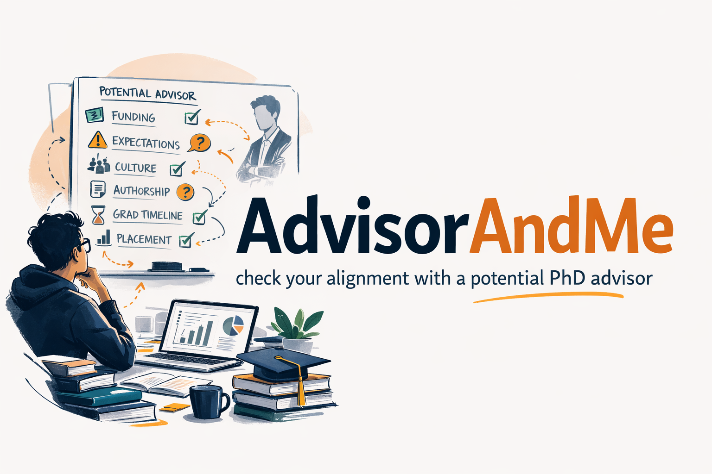

<div align="center">


<h1>AdvisorAndMe</h1>

[](https://shanchen.dev/)
[](https://chenliu-1996.github.io/)

English | [中文](./README.zh.md) 

</div>

Advisor due diligence, not vibes-only.

This repo hosts an advisor-and-me skill for evaluating PhD advisors and labs. The framing is simple: choosing an advisor is a lot like choosing a startup CEO. Start with the failure modes, not the branding. The first job is to identify the critical problems that can seriously damage a PhD: weak funding, unclear graduation standards, abusive culture, poor placement, bad authorship norms, or a lab that looks impressive from far away but does not actually convert student effort into strong outcomes.

`SKILL.md` is the canonical behavior spec. README gives the practical quick-start.

## Install As A CLI Skill

This repo follows the Agent Skills standard with a `SKILL.md` at the skill root.

Install manually (simple and explicit). Run these commands from the repository root:

### Claude Code

```bash
mkdir -p ~/.claude/skills
ln -s "$(pwd)" ~/.claude/skills/advisor-and-me
```

### Codex

```bash
mkdir -p ~/.codex/skills
ln -s "$(pwd)" ~/.codex/skills/advisor-and-me
```

### Cursor

```bash
mkdir -p ~/.cursor/skills
ln -s "$(pwd)" ~/.cursor/skills/advisor-research
```

### Other CLI tools

Place this folder in that CLI's skills directory with the folder name `advisor-and-me`.

After installation, restart the CLI (or refresh its skill list), then invoke `advisor-and-me` using that CLI's syntax.

## Quick Start (Easy Mode)

1. Install the skill (commands above).
2. In Claude Code, run `/advisor-and-me`.
3. Paste a short request with advisor + goal + constraints.

Minimal prompt template:

```text
Evaluate Prof. <name> at <university/department>.
My goal: <academia | industry-research | industry-engineering | startup>.
Top targets: <labs/companies>.
Constraints: <visa/location/funding/workload>.
```

## Demo

Example user prompt:

```text
/advisor-and-me Compare Prof. A (CMU) vs Prof. B (Berkeley) for industry-research.
Targets: OpenAI, Anthropic.
I care about internship-to-offer conversion and visa feasibility.
```

Example output (shortened):

- Verdict: `Proceed with caution` for Prof. A, `Strong fit` for Prof. B
- Industry-research score snapshot: A 62 / B 81
- Verified frontier funnel summary (Applied → Interviewed → Interned → Return offer → Full-time)
- Key risks first (funding, mentorship bandwidth, data coverage gaps)
- Action plan: who to contact this week + what evidence to verify next

## Repo Contents

- `SKILL.md` contains the advisor research skill.
- `agents/openai.yaml` contains optional Codex UI metadata.

## What the Skill Produces

- A cited advisor dossier grounded in public evidence.
- A fit assessment for academia, industry, or startup goals.
- An AI Industry Outcome Scorecard (industry-research, industry-engineering, startup tracks) when non-academic AI goals are relevant.
- A frontier pipeline funnel (applied → interviewed → interned → return offer → full-time) when frontier-lab goals are relevant.
- A PI founder and commercialization assessment (founder history, startup support signals, student-founder precedent).
- Expanded alumni and collaborator mapping with role-family and founder outcomes when publicly verifiable.
- A question bank for advisor conversations and private student backchannels.
- A 12-24 month career plan with contingency paths.
- A practical outreach plan.

## AI Career Planning Framework (Academia + Industry + Founder)

For AI PhD applicants, this skill evaluates career outcomes directly instead of relying on prestige proxies, and supports both academia-focused and non-academic targets:

- **Academic outcome lens**: publication quality, faculty/postdoc placement signals, mentorship depth, and scholarly network quality.
- **Three-track non-academic scorecard**: separate scores for industry-research, industry-engineering, and startup paths.
- **Frontier funnel evidence**: applied → interviewed → interned → return offer → full-time, with explicit uncertainty labels.
- **Founder and commercialization lens**: PI founder history, alumni founder outcomes, and startup support signals (IP, flexibility, leave norms).
- **Role-level alumni analysis**: where alumni land and in what role family (RS, AS, RE, infra, founder), not just company logos.
- **Distribution over outliers**: evaluates top/median/lower-tail placement quality, attrition type, and unemployment risk near graduation when evidence exists.
- **User-defined priorities**: users can supply custom goal mix and evaluation priorities, and the final recommendation reflects that weighting.
- **Actionable execution plan**: a 12-24 month plan with contingency paths if the primary target track does not materialize.

This keeps recommendations evidence-first and career-target specific.

## Data Quality Policy

To reduce false confidence, the skill uses explicit source tiers and coverage checks:

- **Source tiers**: prioritize official lab/university/employer evidence, then bibliometric and profile-based evidence.
- **Verification rule**: high-impact claims (frontier placement, internship conversion, founder outcomes, funding) should be cross-checked with at least two independent sources when possible.
- **Entity resolution**: alumni identities are tagged as resolved, ambiguous, or unresolved before being used in strong claims.
- **Coverage dashboard**: reports how much of the alumni data is actually verified; low coverage forces lower-confidence verdicts.

The output favors transparent uncertainty over overconfident ranking.

## Student Decision Flow (Even Without Running The Skill)

Use this flow before committing to a lab:

```text
Start
  |
  v
[1] Can funding plausibly cover your full PhD timeline?
  |-- No / unclear --> HIGH RISK: do not commit yet; verify grants + fallback plan
  |-- Yes --> continue
  v
[2] Are graduation milestones and typical time-to-degree clear?
  |-- No --> HIGH RISK: ask current and recent alumni before deciding
  |-- Yes --> continue
  v
[3] Is culture healthy (no fear, no chronic overwork, no authorship opacity)?
  |-- No --> HIGH RISK: treat as major red flag
  |-- Yes --> continue
  v
[4] Is there verified outcome evidence for your goal (academia/industry/startup)?
  |-- No --> CAUTION: downgrade confidence, collect more evidence
  |-- Yes --> continue
  v
[5] Is your personal fit workable (topic, location, mentorship style, visa constraints)?
  |-- No --> CAUTION: consider alternatives
  |-- Yes --> proceed to offer decision with explicit risk notes
```

## Manual Checklist (No Tool Needed)

- Ask one current student + one recent alum the same 5 questions.
- Verify one funding fact from an official source.
- Verify at least one alumni outcome for your target path.
- Ask for concrete authorship norms on shared projects.
- Write down your top 3 risks before accepting any offer.

## Start Here: Critical Problems First

Before you get impressed by prestige, ask these first:

- Can this advisor reliably fund me to graduation?
- Do students publish well and graduate on time?
- Is the lab psychologically safe, or does it run on fear and overwork?
- Are authorship and credit handled fairly?
- Does the advisor actually help students reach the careers they want?
- If things go badly, does the lab have a recovery path, or do students just disappear?

If the answer to two or more of these is weak, that is the story. Everything else is secondary.

## Strong Pros and Cons

### Strong Pros

- Strong funding, stable grants, and real contingency plans.
- Clear student outcomes in academia, industry, or both.
- A research agenda with real taste and enough infrastructure to execute.
- Students can explain authorship, milestones, and meeting cadence without hesitation.
- The advisor gives timely feedback and helps unblock stuck projects.
- Students sound candid, respected, and broadly sane.

### Strong Cons

- Prestige without student outcomes.
- Big promises but vague funding details.
- Lots of papers, but unclear student ownership.
- Lab members who are afraid to speak plainly.
- Graduation timelines that drift without explanation.
- An advisor who says they support industry or non-traditional paths, but alumni evidence says otherwise.

## Critical Suggestions

- Prioritize downside protection before upside. A safe, productive lab usually beats a famous chaotic one.
- Separate advisor reputation from student outcomes. These are not the same variable.
- Treat every vague answer as a signal. Good labs can usually explain how things work.
- Ask current and former students the same question and compare the differences.
- Optimize for optionality if you are uncertain about academia versus industry.
- Do not ignore how you feel after conversations. Confusion, tension, or evasiveness usually means something.

## Core Criteria

### 1. Survival, Physical, and Mental Health

- Is the stipend, tuition coverage, and benefits package enough to live on?
- Is there real funding security, or are you one grant decision away from trouble?
- Are the hours sustainable, or is burnout treated as normal?
- Is the lab respectful, or does it run on chaos, bullying, or fear?
- Are expectations clear enough that you know what good progress looks like?
- Is there flexibility when health, family, or immigration issues come up?

### 2. Academic Career Outcome

- Do students publish consistently, and in what venues?
- Where do graduates go: postdocs, faculty jobs, research labs, or nowhere obvious?
- How strong is the advisor's reputation and network in the field?
- Is there enough funding stability for students to finish?
- Do students get real training in writing, presenting, and networking?
- Is there a healthy balance between guidance and independence?

### 3. Industry Career Outcome

- Does the lab produce verifiable outcomes into frontier labs, applied AI roles, or both?
- What does the frontier funnel look like (applied → interviewed → interned → return offer → full-time)?
- Are alumni landing in strong industry jobs, and at what role families (RS, AS, RE, infra, founder)?
- Is there concrete internship-to-offer evidence, not just anecdotal claims?
- Is the advisor supportive of non-academic paths?
- Can students do internships or industry collaborations without drama?
- How is the lab viewed by employers outside academia?

### 4. Happiness and Day-to-Day Fit

- Are you genuinely excited by the research topic?
- Is the day-to-day work engaging, or mostly grindy and boring?
- Is the advisor available when students are stuck?
- Do students in the group seem compatible and supportive?
- Is the location and overall lifestyle workable for you?
- Does the work feel meaningful enough to sustain several years?

## Cross-Cutting Due Diligence

| Area | What to verify |
| --- | --- |
| Ecosystem and resources | Academic network, co-authors, compute, equipment, data access, and whether the lab has the actual infrastructure to execute its agenda. |
| Advisor career stage | Assistant professors may be more hands-on but more intense; senior faculty may bring more prestige and resources but provide less direct attention. |
| Research vision and execution | The lab's taste, biggest open problems, project quality, execution speed, and whether the advisor can turn ideas into papers rather than just talks. |
| Mentorship style | Micromanagement versus hands-off advising, meeting cadence, expectation clarity, and whether the style actually matches how you work best. |
| Authorship and credit | Who gets first authorship, how cross-student work is handled, and whether postdocs ever crowd out student ownership. |
| Feedback speed | Whether paper drafts and project decisions move fast enough to hit deadlines. |
| Career development | Support for academia, industry, startups, internships, and, when relevant, visa or immigration processes; include evidence for internship conversion and founder pathways when relevant. |
| Lab culture | Internal competition versus collaboration, how conflict is handled, and whether students seem healthy, candid, and supported. |

## Questions To Ask The Advisor

- What are the biggest unsolved problems you think this lab can realistically win on, and why?
- If I joined now, what exact project would I start on, and are the required data, compute, equipment, and collaborators already in place?
- How are students funded year by year, what can interrupt that funding, and what is the fallback plan if a grant ends?
- What are the concrete graduation milestones, and what is the real median time to finish in your group?
- How often do you meet students one-on-one, and what is your normal turnaround time on draft feedback?
- How do you decide authorship and first-author ownership on shared projects?
- What happens when a student's project is not working for several months?
- What is your actual stance on industry internships, non-academic careers, startups, and students whose goals change, and what recent outcomes back that up?
- How do you support students through health, family, visa, or other personal disruptions without derailing the degree?

## Questions To Ask Current Or Former Students

- What is day-to-day life in the lab actually like when nobody is performing for visitors?
- Are weekends, vacations, and sick time genuinely respected?
- What happens when a project fails, stalls, or gets scooped?
- When students struggle, does the advisor help, ignore them, or turn up the pressure?
- How fast does the advisor review drafts and make decisions in practice?
- Has anyone quit, switched labs, or been pushed out? Why?
- Do students usually feel they own their projects, or do postdocs and senior students dominate the good work?
- How much does the advisor really help with internships, jobs, recommendation letters, and visa issues, and can you point to specific recent cases?
- What do you wish you had understood before joining?
- What concern feels minor from the outside but becomes serious once you are inside the lab?

## Common Red Flags

- Funding answers are vague, inconsistent, or depend on who you ask.
- Students cannot clearly explain authorship norms.
- Current students sound scripted, guarded, or afraid to be honest.
- The lab celebrates overwork as proof of commitment.
- Students stay a long time without strong outputs or clear milestones.
- Industry internships are discouraged for opaque reasons.
- Alumni outcomes are hard to verify or strangely narrow.
- No one can tell you what happens when a student struggles.

## Bottom Line

Treat advisor selection like due diligence. Talk to the advisor for vision and resources, but rely on students for the truth about execution, culture, and day-to-day reality. For AI PhD paths, prioritize verifiable career outcomes: frontier funnel evidence, role-level alumni trajectories, and founder/commercialization signals when startup goals matter. The best choice is usually the advisor who gives you enough safety, enough growth, and enough evidence-backed career optionality to do great work without wrecking your life.
